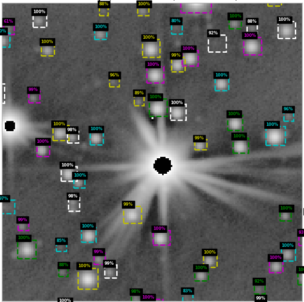
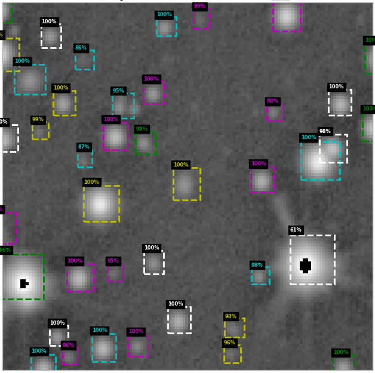
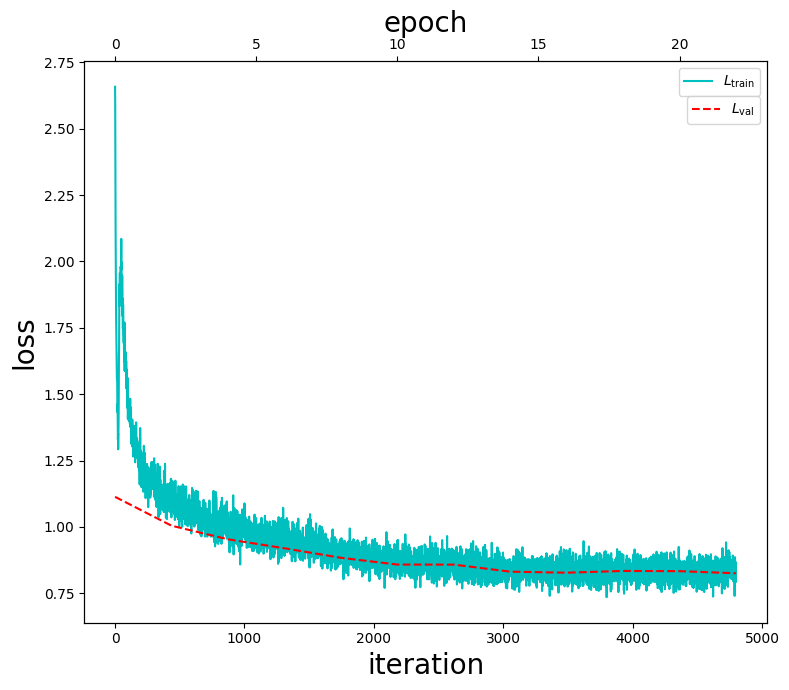
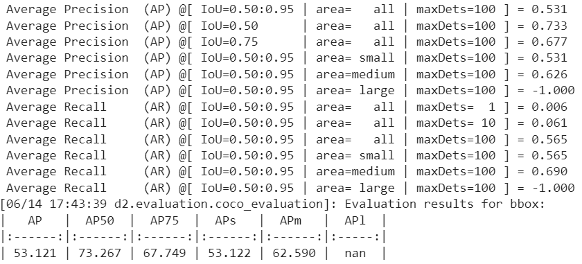
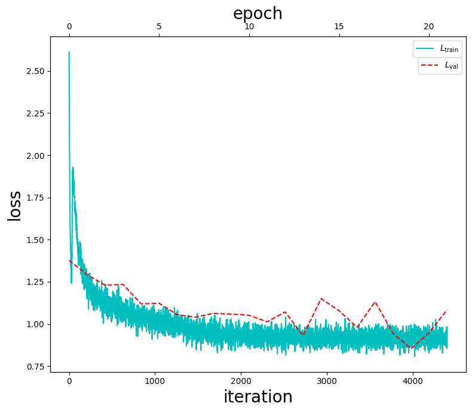
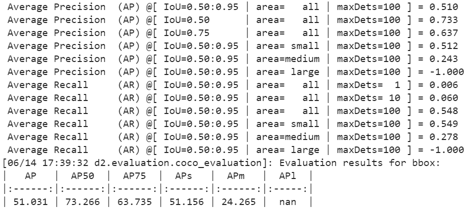

# StarDet
Objects detection in defective astronomical images using FPN-based CNN.

Models based on *mask_rcnn_X_101_32x8d_FPN_3x*  by [detectron2](https://github.com/facebookresearch/detectron2).

# Description
StarDet has been trained on defective astronomical images, allowing it to be used on images with background irregularities, star blooms and other defects. Example of detection on real images:

    
    

Trained 2 models differing in anchor size, number of epochs and lr decay coeffitient. Models can be downloaded here:
https://drive.google.com/drive/folders/1yaLpcUBMpBNxMih3BnnM3UbAxmd1b-08?usp=sharing.

An example of detection on real astronomical images with the listed models is presented in [example_real_images.ipynb](example_real_images.ipynb).
In [model_training.ipynb](model_training.ipynb) you can see the training approach or train your own model with an example.

*The model parameters and the CLAHE coefficients need to be adjusted for the images of the observatory of interest.*
# Models
**model_24e_anc4-64** params:
- Anchor_generator.sizes = [4, 8, 16, 32, 64]
- Num_epoch = 24

Evaluate and Losses of the model:
<table>
  <tr>
    <td>
      
    </td>
  </tr>
  <tr>
    <td>
      
    </td>
  </tr>
</table>

**model_22e_anc8-128** params:
- Anchor_generator.sizes = [8, 16, 32, 64, 128]
- Num_epoch = 22
 
Evaluate and Losses of the model:
<table>
  <tr>
    <td>
      
    </td>
  </tr>
  <tr>
    <td>
      
    </td>
  </tr>
</table>

